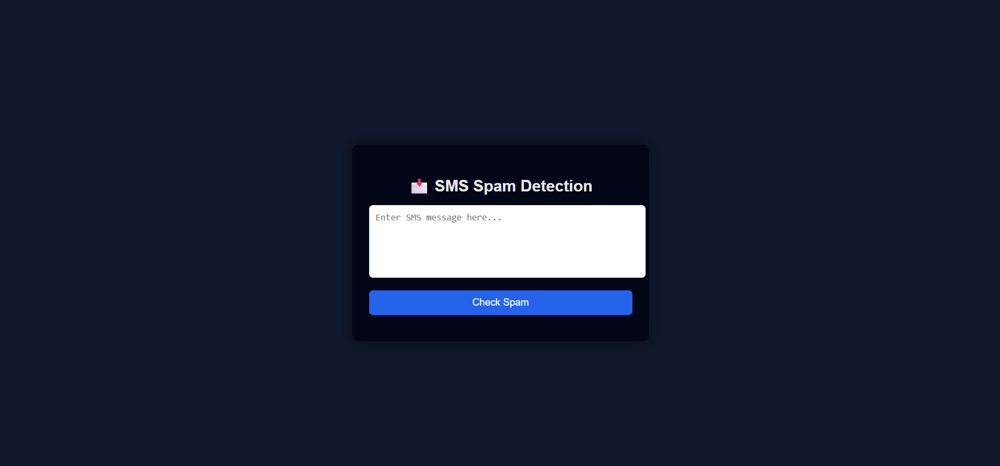
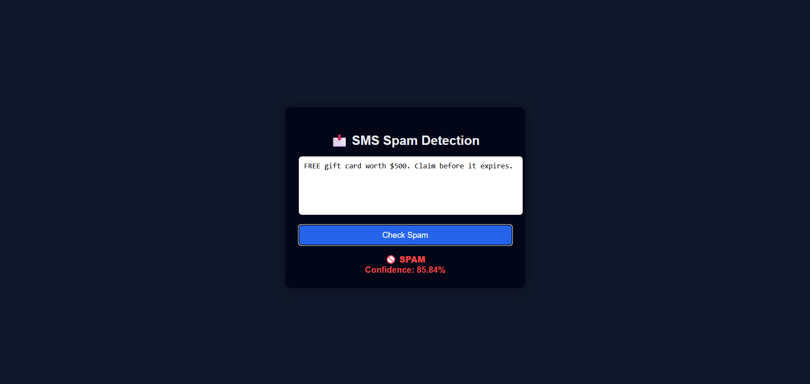

# 📩 SMS Spam Detection System

A full-stack **Machine Learning web application** that classifies SMS messages as **Spam** or **Not Spam** using **Natural Language Processing (NLP)** and a trained ML model.  
The application provides **real-time predictions with confidence scores** and is deployed on **Vercel**.

🔗 **Live Demo:**  
👉 https://sms-spam-detection-five.vercel.app/

---

## 🚀 Features
- Real-time SMS spam classification
- Confidence score (%) for each prediction
- Clean and responsive web interface
- REST API built with Flask
- NLP-based text preprocessing
- Fully deployed on Vercel (Frontend + Backend)

---

## 🧠 Machine Learning Details
- **Text Preprocessing:** Tokenization, stopword removal
- **Feature Extraction:** TF-IDF Vectorization
- **Model:** Multinomial Naive Bayes
- **Accuracy:** ~97% on benchmark dataset
- **Output:** Spam / Not Spam with confidence score

---

## 🛠 Tech Stack

### Frontend
- HTML5  
- CSS3  
- JavaScript (Fetch API)

### Backend
- Python  
- Flask (REST API)

### Machine Learning / NLP
- Scikit-learn  
- TF-IDF  
- Multinomial Naive Bayes  
- Pandas, NumPy

### Deployment
- Vercel

---

## 📂 Project Structure
SMS-SPAM-DETECTION/
├── api/
│ ├── index.py
│ └── templates/
│ └── index.html
├── screenshots/
│ ├── home.png
│ ├── spam.png
│ └── not-spam.png
├── model.pkl
├── vectorizer.pkl
├── spam.csv
├── requirements.txt
├── vercel.json
└── README.md

---

## 🔌 API Usage

### Endpoint

### Request Body
{
  "message": "Congratulations! You won a free prize"
}
### Response

  "spam": true,
  "confidence": 93.45
  
## 🧪 Example Predictions

| Message | Result | Confidence |
|--------|--------|------------|
| Happy birthday, have a great day! | Not Spam | 98% |
| Win ₹10,000 cash now! Click link | Spam | 94% |

## 📸 Screenshots

| Home Page | Prediction Result |
|----------|-------------------|
|  |  |

## 📈 Future Improvements
- Confidence progress bar visualization  
- Probability breakdown (Spam vs Ham)  
- Multi-language support  
- Model explainability (feature importance)  
- User authentication and logging  

👤 Author

Abdul Samad
B.Tech – Computer Science (Artificial Intelligence & Machine Learning)

⭐ If you found this project useful, consider giving it a star on GitHub!

---

### ✅ Next (optional but powerful)
If you want, I can:
- add a **Screenshots** section to README  
- write **interview explanation (How it works)**  
- create **resume-ready project bullets**  
- improve UI with **confidence bar animation**

Just say what’s next 🚀
