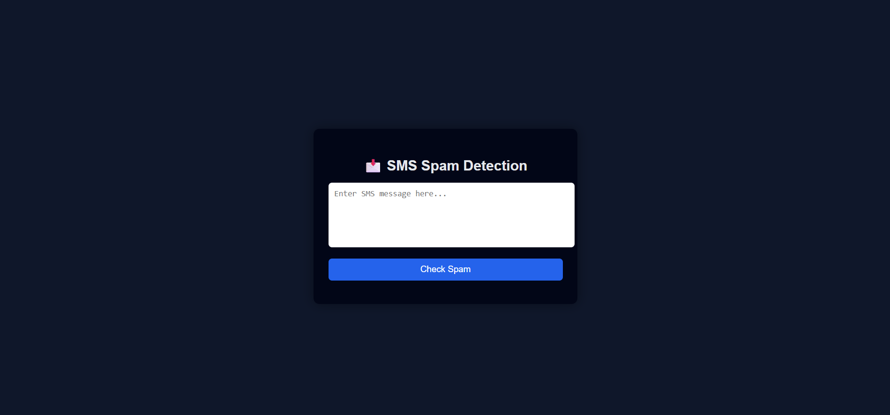
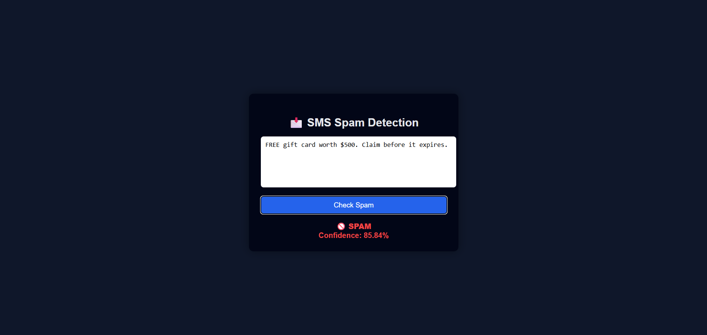

# 📩 SMS Spam Detection System

[](https://www.python.org/)
[](https://flask.palletsprojects.com/)
[](https://scikit-learn.org/)
[](https://sms-spam-detection-five.vercel.app/)
[](#license)
 
A full-stack machine learning web application that classifies SMS messages as **Spam** or **Not Spam** in real time, using natural language processing and a trained classification model. Built with a Flask REST API backend and a lightweight JavaScript frontend, fully deployed on Vercel.

**🔗 Live Demo:** [sms-spam-detection-five.vercel.app](https://sms-spam-detection-five.vercel.app/)

---

## Table of Contents

- [Overview](#overview)
- [Features](#features)
- [How It Works](#how-it-works)
- [Tech Stack](#tech-stack)
- [Machine Learning Pipeline](#machine-learning-pipeline)
- [Project Structure](#project-structure)
- [Getting Started](#getting-started)
- [Retraining the Model](#retraining-the-model)
- [API Reference](#api-reference)
- [Example Predictions](#example-predictions)
- [Screenshots](#screenshots)
- [Limitations](#limitations)
- [Future Improvements](#future-improvements)
- [Contributing](#contributing)
- [License](#license)
- [Author](#author)

---

## Overview

SMS Spam Detection System takes a raw text message as input and returns a spam/not-spam classification along with a confidence score. The model was trained on a labeled SMS dataset using TF-IDF vectorization and a Multinomial Naive Bayes classifier, achieving ~97% accuracy on the benchmark dataset. The entire application — frontend and backend — is deployed as a single Vercel project.

## Features

- Real-time SMS spam classification via a REST API
- Confidence score (%) returned alongside every prediction
- Clean, responsive web interface
- NLP-based text preprocessing (tokenization, stopword removal)
- Serverless deployment on Vercel (frontend + backend in one project)

## How It Works

```
 User Input (SMS text)
        │
        ▼
 Text Preprocessing
 (lowercasing, tokenization, stopword removal)
        │
        ▼
 TF-IDF Vectorization
 (text → numerical feature vector)
        │
        ▼
 Multinomial Naive Bayes Model
 (loaded from model.pkl)
        │
        ▼
 Prediction + Confidence Score
 (Spam / Not Spam, %)
        │
        ▼
 JSON Response → Frontend Display
```

Each request to `/predict` runs through this pipeline synchronously, and the Flask API returns the classification along with the model's confidence for that prediction.

## Tech Stack

| Layer | Technologies |
|---|---|
| Frontend | HTML5, CSS3, JavaScript (Fetch API) |
| Backend | Python, Flask (REST API) |
| ML / NLP | scikit-learn, TF-IDF, Multinomial Naive Bayes, pandas, NumPy |
| Deployment | Vercel |

## Machine Learning Pipeline

1. **Text Preprocessing** — lowercasing, tokenization, stopword removal
2. **Feature Extraction** — TF-IDF vectorization
3. **Model** — Multinomial Naive Bayes
4. **Accuracy** — ~97% on the benchmark dataset
5. **Output** — binary label (Spam / Not Spam) with an associated confidence score

The trained model and vectorizer are serialized with pickle (`model.pkl`, `vectorizer.pkl`) and loaded at request time by the Flask API.

## Project Structure

```
SMS-SPAM-DETECTION/
├── api/
│   ├── index.py            # Flask app / API entry point
│   └── templates/
│       └── index.html      # Frontend UI
├── screenshots/
│   ├── home.png
│   ├── spam.png
│   └── not-spam.png
├── model.pkl                # Trained Naive Bayes model
├── vectorizer.pkl           # Fitted TF-IDF vectorizer
├── spam.csv                  # Training dataset
├── requirements.txt
├── vercel.json
└── README.md
```

## Getting Started

### Prerequisites
- Python 3.9+
- pip

### Installation

```bash
# Clone the repository
git clone https://github.com/abdul-samad-001/SMS-SPAM-DETECTION.git
cd SMS-SPAM-DETECTION

# Install dependencies
pip install -r requirements.txt

# Run the Flask app locally
python api/index.py
```

The app will be available at `http://localhost:5000` (or the port configured in `api/index.py`).

## Retraining the Model

The model can be retrained from scratch if `spam.csv` is updated with new labeled data:

```bash
# Example retraining flow (adapt to your actual training script name)
python train_model.py
```

This regenerates `model.pkl` and `vectorizer.pkl` using the same TF-IDF + Multinomial Naive Bayes pipeline described above. Keeping the training script in the repo (rather than only the serialized `.pkl` files) makes the model fully reproducible — worth doing if you don't already have one checked in.

## API Reference

### Predict message classification

```
POST /predict
```

**Request Body**

```json
{
  "message": "Congratulations! You won a free prize"
}
```

**Response**

```json
{
  "spam": true,
  "confidence": 93.45
}
```

| Field | Type | Description |
|---|---|---|
| `spam` | boolean | `true` if the message is classified as spam |
| `confidence` | number | Model confidence for the predicted class, as a percentage |

## Example Predictions

| Message | Result | Confidence |
|---|---|---|
| "Happy birthday, have a great day!" | Not Spam | 98% |
| "FREE gift card worth $500. Claim before it expires." | Spam | 85.84% |

## Screenshots

| Home Page | Prediction Result |
|---|---|
|  |  |

## Limitations

- Trained and evaluated on English-language SMS text only; performance on other languages or heavily abbreviated/code-mixed text is untested.
- The training dataset is a fixed benchmark set; it may not fully reflect the diversity of real-world spam patterns (e.g. evolving phishing tactics).
- No authentication or rate limiting on the API endpoint — not intended for production traffic as-is.

## Future Improvements

- Visual confidence indicator (progress bar) for improved result interpretability
- Detailed probability distribution for Spam vs. Not Spam predictions
- Multi-language support for broader usability
- Model explainability to highlight the features driving each prediction
- User authentication and request logging for security and analytics

## Contributing

Contributions are welcome. Please open an issue to discuss a change before submitting a pull request, and keep PRs focused on a single improvement or fix.

## License

This project is licensed under the MIT License. See the [LICENSE](LICENSE) file for details.

## Author

**Abdul Samad**
B.Tech — Computer Science (Artificial Intelligence & Machine Learning)

If you found this project useful, consider giving it a ⭐ on GitHub.
